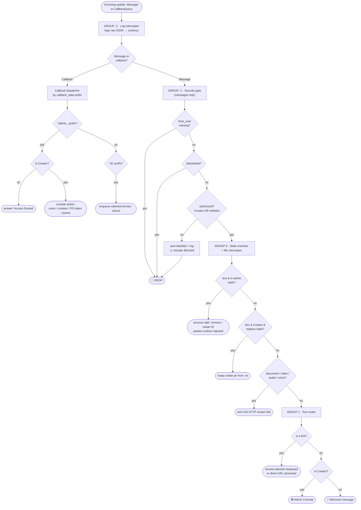
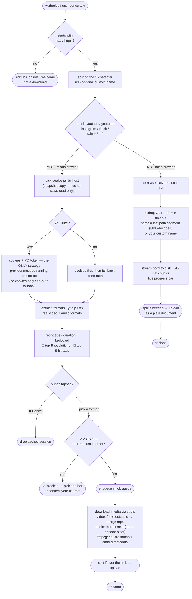

# tgbot — Private Media Downloader & Streamer for Telegram

A private, secure, resource-efficient Telegram bot that downloads media from
**YouTube, Instagram, TikTok, X/Twitter, and every other site supported by
yt-dlp nightly**, uploads it to Telegram (auto-split across the 2 GB / 4 GB
ceiling), and can hand out **direct HTTP stream links** for any file you forward
to it — piped straight from Telegram's servers with zero local buffering.

Built on **pyrogram**. Provisioned with a one-shot `./install.sh` (no Docker
required). Runs as a `systemd` service that survives reboots.

> **New to this?** The complete, beginner-friendly walkthrough — from "I just
> bought a VPS" to "the bot is live" — lives in
> [`docs/UBUNTU_VPS_SETUP.md`](docs/UBUNTU_VPS_SETUP.md). This README is the
> overview; the architecture deep-dive is in [`blueprint.md`](blueprint.md).

---

## ✨ Key features

- **🔑 PO-token YouTube support.** A local `bgutil-ytdlp-pot-provider` Deno server
  mints proof-of-origin tokens so YouTube extractions keep working. Cookies + PO
  token, no silent fallback — and a one-click **diagnose** in the Admin Console.
- **🍪 Protected cookie jars.** Each download gets a disposable snapshot; the live
  YouTube jar is locked read-only and backed up. Test / Save Backup / Restore
  Backup from the console. No more yt-dlp corruption.
- **🛡️ Granular security gate.** Three tiers: System Creator (you), dynamically
  whitelisted users, and everyone else (auto-ignored). Intruders are blacklisted.
- **🧩 Morphing Admin Console.** An inline-button console to manage users, cookie
  jars, the PO-token provider, document mode, and the transfer queue.
- **🎚️ Two-column format selector.** Paste a link → video formats on the left,
  audio on the right, sorted by quality, labeled with estimated file sizes.
- **🎞️ Metadata & thumbnails.** `ffmpeg` square-crops thumbnails (Telegram
  requirement) and embeds duration / resolution / title so media plays natively.
- **⬆️ Big-file uploads.** On-demand keyframe splitting keeps every part
  independently playable; the Bot API handles 2 GB, a Premium userbot lifts it to
  4 GB. Only one extra segment ever sits on disk.
- **🔄 Auto-updating engine.** A background loop upgrades `yt-dlp` to its nightly
  build every 6 hours (preserving the `[default]` extras).
- **🔗 Zero-disk streaming.** Forward a Telegram file → get an HTTP stream link.
  Files pipe from Telegram to your browser on the fly via a FastAPI bridge.
- **🩺 Site-aware errors.** Opaque yt-dlp exceptions become clear messages:
  sign-in required, geo-blocked, rate-limited, private/deleted, live/storyboard.

---

## 📋 Requirements

1. **An Ubuntu VPS** — Ubuntu 24.04 LTS is the main focus. A 1 GB box works
   (the installer provisions a 2 GB swap file); 2 GB+ is comfortable.
2. **Telegram credentials:**
   - `API_ID` + `API_HASH` from [my.telegram.org](https://my.telegram.org).
   - `BOT_TOKEN` from [@BotFather](https://t.me/BotFather).
   - Your numeric Telegram user ID (message [@userinfobot](https://t.me/userinfobot)).
3. **That's it.** `install.sh` installs everything else (git, python, ffmpeg,
   tmux, Deno, the PO-token provider, swap).

---

## 🚀 Quick start

```bash
# 1. Get the code
git clone https://github.com/salehMomtaz/tgbot.git
cd tgbot

# 2. Provision the server (apt, Deno, venv, PO-token provider, swap, systemd unit)
./install.sh

# 3. Edit .env with your real tokens
nano .env
#    → fill in API_ID, API_HASH, BOT_TOKEN, SYSTEM_CREATOR_ID

# 4. Start as a managed service (survives reboot, auto-restarts on crash)
sudo systemctl enable --now tgbot

# 5. Watch it come up
sudo journalctl -u tgbot -f
```

Then open Telegram, message your bot, send `/start` (or `console`), open the
**🛠 Admin System Console**, and upload your YouTube cookies
(**Cookie Jars → YouTube → Replace**). See the
[VPS setup guide](docs/UBUNTU_VPS_SETUP.md) for the fully-explained version,
including how to generate a Premium session, set up a log channel, and get
cookies.

---

## 🛠 The Admin Console

Send `console` (or `/start`) to the bot as the System Creator. You get an
inline-button console:

| Button | What it does |
|---|---|
| 👥 List / ➕ Add / ➖ Remove Users | Manage the whitelist of people who can use the bot. |
| 🚫 Blacklist Logs | See (and unban) auto-blocked intruders. |
| 📄 Doc Mode | Toggle sending media as plain documents (no re-encode). |
| 🍪 Cookie Jars | Per-site jars: **Download / Replace**, and for YouTube also **Test / Save Backup / Restore Backup**. |
| 🔐 PO Token | Start / stop / restart / diagnose the PO-token provider; live status badge. |
| 💥 Abort Transfer | Cancel everything in the queue and purge the cache. |

---

## 🧭 How the bot handles a message

Every update pyrogram receives is routed through an ordered **handler
pipeline**. Handlers are grouped, and groups run in ascending order
(`-2 → -1 → 0 → 1`). A handler that matches usually consumes the update;
`stop_propagation()` kills it entirely, `ContinuePropagation` hands it to the
next handler in the same group. This is how the bot distinguishes **you**
(the System Creator), **whitelisted users**, and **strangers** — and silently
locks the door on the last group.

### User tiers

| Tier | Who | Result at the security gate | What they can do |
|---|---|---|---|
| 🟣 **System Creator** | `SYSTEM_CREATOR_ID` in `.env` | Always passes | Everything a user can do **+ the Admin Console** |
| 🟢 **Whitelisted user** | ID listed in `database.json` → `authorized` | Passes | Download/upload links, forward files for stream links |
| 🔴 **Stranger / intruder** | Anyone not in the two rows above | **Auto-blacklisted**, logged as `⚠️ Intruder Blocked`, dropped | Nothing — silently ignored from now on |

> Blacklisted users (including every stranger who ever messaged the bot) are
> dropped before any handler logic runs. The Creator can review and unban them
> via **Blacklist Logs** in the console.

### Message flow (vertical)



The same pipeline in plain text (renders anywhere, terminal included):

```
                  ┌──────────────────────────────────┐
  Telegram update │   MESSAGE  or  CALLBACK QUERY    │
                  └────────────────────┬─────────────┘
                                       │
            ┌──────────────────────────▼──────────────────────────┐
  GROUP -2  │  LOG INTERCEPTOR — logs raw JSON, then continues    │
            └──────────────────────────┬──────────────────────────┘
                                       │
            ┌──────────────┴──────────────┐
            │ MESSAGE                     │ CALLBACK
            ▼                             ▼
  ┌─────────────────────┐     ┌───────────────────────────────────┐
  │ GROUP -1  SECURITY  │     │ CALLBACK DISPATCHER (by prefix)   │
  │ GATE (msgs only)    │     │                                   │
  │                     │     │ ^admin_ + not Creator → "Denied"  │
  │ no from_user ──►DROP│     │ ^admin_ + Creator ─► console      │
  │ blacklisted ──►DROP │     │   action (users/cookies/POT/...)  │
  │ not authorized ──►  │     │ ^dl: ──► enqueue chosen format    │
  │   auto-blacklist +  │     └───────────────────────────────────┘
  │   "Intruder" ──►DROP│
  │ else ──► continue   │
  └─────────┬───────────┘
            │ (authorized)
  ┌─────────▼───────────┐
  │ GROUP 0  STATE +    │  text + admin state  ─► add/remove/unban ID
  │ FILE INTERCEPTOR    │  doc + Creator +      ─► swap cookie jar
  │                     │    replace-state        from uploaded .txt
  │                     │  document/video/      ─► mint 24h stream link
  │                     │  audio/voice
  └─────────┬───────────┘
            │
  ┌─────────▼───────────┐  is a link? ──► format keyboard or direct
  │ GROUP 1  TEXT ROUTER│                download (defense-in-depth
  │                     │                 auth re-check inside)
  │                     │  Creator  ──► 🛠 Admin Console
  │                     │  anyone   ──► 👋 Welcome message
  └─────────────────────┘
```

### Notes

- The **security gate only applies to messages**, not callback button presses.
  Callbacks are protected per-handler instead: admin buttons check for the
  Creator; download buttons (`dl:`) are only ever handed to a user who already
  passed the gate and received a format keyboard.
- A forwarded **file** (video / audio / voice / document) never reaches the
  text router — the file interceptor in Group 0 turns it into a stream link
  first.
- **Document Mode** (toggled in the console) changes *how* a finished file is
  uploaded (plain document vs. re-encoded media), not *whether* it flows through
  this pipeline.

### How a link is routed & downloaded

Only one handler owns text-that-is-a-link (`downloader_handler.py`, Group 1).
It fires **only when the message starts with `http://` or `https://`**. Inside,
the first fork decides almost everything: **is the host one of the six media
crawlers, or not?** The two branches share almost nothing.

| What you send | Detected as | Path taken |
|---|---|---|
| `youtube.com` / `youtu.be` | social → YouTube | yt-dlp · cookies **+ PO token** (only strategy) · format keyboard |
| `instagram.com` | social → Instagram | yt-dlp · `igcookies.txt` → no-auth fallback · format keyboard |
| `tiktok.com` | social → TikTok | yt-dlp · `ttcookies.txt` → no-auth fallback · format keyboard |
| `twitter.com` / `x.com` | social → X | yt-dlp · `xcookies.txt` → no-auth fallback · format keyboard |
| **any other URL** | **direct file** | raw HTTP download — **no yt-dlp, no cookies, no format choice** |

> ⚠️ The "direct file" branch is broader than it looks — it is **not** "all the
> other yt-dlp sites." Only the six domains above ever reach yt-dlp. A Vimeo,
> Soundcloud, Dailymotion, Facebook, or Reddit link — even though yt-dlp supports
> them — is treated as a **direct file URL**: the bot just does an HTTP `GET` on
> exactly the link you pasted. For a genuine direct file (`…/clip.mp4`,
> `…/archive.zip`, `…/report.pdf`) that's correct and fast. For a media *page*
> URL on a non-listed host you'll get the HTML page, not the media. You can also
> append ` | custom-name.ext` to any link to rename the result.



---

## 🍪 Cookies

YouTube and age/login-restricted sites need browser cookies. The easiest path:
install a "Get cookies.txt" browser extension, log in to the site, export, and
**Replace** the jar in the console (paste the text, *or* send a `.txt` file).

The bot protects your jars:
- The live `ytcookies.txt` is **read-only** so yt-dlp can't corrupt it.
- Each download uses a **snapshot copy** that's auto-purged later.
- **Save Backup** freezes the current jar to `ytcookies.backup`; **Restore Backup**
  brings it back. A trashed/empty live jar auto-restores from the backup on boot.
- **Test** runs a real extraction against a public video and tells you exactly how
  many formats YouTube returned (or if the jar is bot-flagged).

---

## 📜 Logs

Two streams, both useful:

- **Service log** (stdout/stderr): `sudo journalctl -u tgbot -f`
- **Bot's own log** (timestamped, rotated at 5 MB × 3): `tail -f logs/bot.log`
- Optional **Telegram log channel**: set `LOG_CHANNEL_ID` in `.env` (create a
  private channel, add the bot as admin). All of the above mirror there too.

---

## 🔄 Updating the bot

```bash
cd ~/tgbot
git pull origin main
sudo systemctl restart tgbot          # picks up new code
# (install.sh is idempotent — re-run it after a big change to refresh deps/provider)
```

`yt-dlp` updates itself to nightly every 6 hours automatically; no restart needed
for extractor fixes.

---

## 🐳 Docker (optional / legacy)

Docker is **supported but no longer the recommended path**. The bare-metal
`install.sh` + `systemd` flow above is simpler, lighter on a 1 GB VPS, and is
what this project targets. If you still want Docker, the image is self-contained
— it installs Deno, the Python deps, **and** clones + builds the PO-token provider
so YouTube works out of the box:

```bash
cp .env.example .env && nano .env   # fill in your secrets first
docker compose up --build -d
docker compose logs -f --tail=50
```

The provider is built into the image under `/opt` (outside the `.:/app` bind-mount)
and `YTDLP_POT_PROVIDER_PATH` is set automatically. Provide your secrets in `.env`
(secrets are **not** baked into the image).

---

## 🔒 Security & privacy

`.gitignore` already protects your secrets. **Never commit** (or paste publicly):

- `.env` — your Bot Token, API keys, session string.
- `database.json` — whitelisted user IDs.
- `*cookies.txt` / `ytcookies.backup` — live browser sessions.
- `*.session` / `*.session-journal` — active bot/userbot authorization.

The PO-token provider is patched to bind **`127.0.0.1` only** — it is never
reachable from the internet.

---

## 📚 More

- **Beginner VPS guide:** [`docs/UBUNTU_VPS_SETUP.md`](docs/UBUNTU_VPS_SETUP.md)
- **Architecture deep-dive:** [`blueprint.md`](blueprint.md)
- **Contributor / agent notes:** [`AGENTS.md`](AGENTS.md)
